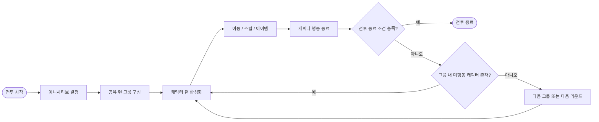

# ProjectB3

  <strong>UE5.6 기반 D&D 5e 스타일 턴제 전술 RPG</strong>

  
  
  

---

## 시연 영상

---

## 게임 소개

`ProjectB3`는 D&D 5e 스타일의 주사위 판정과 턴 진행을 기반으로 한 턴제 전술 RPG 게임입니다.
전투 참가자의 이니셔티브를 결정하고, 같은 진영의 연속된 캐릭터를 공유 턴 그룹으로 묶어 행동을 진행합니다.

---

## 개발 정보

| 항목 | 내용 |
|:---|:---|
| 장르 | 턴제 전술 RPG |
| 규칙 | D&D 5e 스타일 주사위 판정 |
| 엔진 / 언어 | Unreal Engine 5.6 / C++ |
| 플랫폼 | Windows |
| 팀 구성 | 프로그래머 3인 |
| 개발 기간 | 2026.03.02 ~ 2026.03.31 |

## 👨‍💻 개발자

<table>
  <tr>
    <td align="center">
      <strong>배유찬</strong>  
      
    </td>
    <td align="center">
      <strong>최승현</strong>  
      
    </td>
    <td align="center">
      <strong>강리한</strong>  
      
    </td>
  </tr>
</table>

---

## 핵심 구현

### 전투 진행 흐름

공유 턴 그룹 안에서는 아직 행동을 마치지 않은 캐릭터로 전환할 수 있습니다.
그룹의 모든 캐릭터가 행동을 마치면 다음 그룹으로 진행합니다.

### 턴제 전투 코어

- 전투 시작 시 D20 기반 이니셔티브 결정
- 연속된 같은 진영 캐릭터를 공유 턴 그룹으로 구성
- 그룹 내 캐릭터별 행동 완료 상태 관리
- 행동불능 캐릭터 처리 및 전투 종료 조건 관리
- 전투 상태와 턴 변경을 이벤트로 전달

### GAS 기반 전투

- Gameplay Ability System을 이용한 어빌리티 실행
- 명중, 피해, 내성 주사위 판정
- AttributeSet과 ExecutionCalculation을 이용한 스탯·피해 처리
- GameplayEffect를 이용한 버프, 디버프, 회복
- 턴 단위 지속 효과와 행동 자원 처리

### 타겟팅 및 환경 판정

- 단일 대상, 다중 대상, 지면 대상, 범위 대상 타겟팅
- 스킬 사거리와 Line of Sight 판정
- NavigationSystem과 EQS를 이용한 이동 위치 탐색
- 이동 경로와 타겟 유효성의 디버그 시각화

### AI

- StateTree와 AI Controller 기반 행동 처리
- EQS를 이용한 위치 및 대상 탐색
- 전투 상황에 따른 행동 평가

---

## 실행 환경

### 요구 사항

- Windows
- Unreal Engine 5.6
- Visual Studio 2022 및 C++ 게임 개발 workload
- Git LFS

### 실행 방법

1. 저장소를 clone한 뒤 Git LFS 파일을 다운로드
2. `ProjectB3.uproject`로 Visual Studio 프로젝트 파일을 생성
3. `ProjectB3.sln`을 `Development Editor` / `Win64`로 빌드
4. Unreal Editor에서 `ProjectB3.uproject`를 실행

---

## 개발 범위

턴제 전투 규칙과 전투 시스템의 확장에 초점을 둔 프로젝트입니다.
반응 행동은 상태와 이벤트 확장 지점만 구성되어 있으며, 기회공격과 같은 실제 콘텐츠는 포함하지 않습니다.
